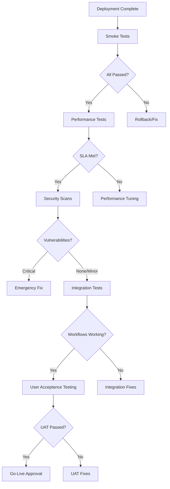

# Post-Deployment Validation Guide

This guide provides comprehensive procedures and scripts for validating deployments after they are released to production or staging environments. It covers automated testing, performance validation, security scanning, and user acceptance testing.

## Table of Contents

1. [Validation Overview](#validation-overview)
2. [Automated Smoke Tests](#automated-smoke-tests)
3. [Performance Validation](#performance-validation)
4. [Security Scans](#security-scans)
5. [Integration Testing](#integration-testing)
6. [User Acceptance Testing](#user-acceptance-testing)
7. [Validation Automation](#validation-automation)
8. [Reporting and Notifications](#reporting-and-notifications)

## Validation Overview

### Validation Types

| Type | Purpose | Timing | Automation Level |
|------|---------|--------|------------------|
| Smoke Tests | Basic functionality verification | Immediately after deployment | Fully automated |
| Performance Tests | Response times and resource usage | Within 30 minutes | Semi-automated |
| Security Scans | Vulnerability assessment | Within 1 hour | Automated |
| Integration Tests | End-to-end workflow validation | Within 2 hours | Semi-automated |
| UAT | Business logic validation | Within 24 hours | Manual |

### Validation Stages



## Automated Smoke Tests

### Purpose
Smoke tests verify that the basic functionality of the application is working after deployment. These are quick, automated tests that check critical paths.

### Test Coverage

#### API Endpoints
- Health check endpoints (`/health`, `/ready`, `/status`)
- Authentication endpoints
- Core business logic endpoints
- Database connectivity

#### Frontend Components
- Application loading
- Basic navigation
- User authentication flow
- Critical user journeys

#### Infrastructure
- Service discovery
- Load balancer configuration
- Database connections
- External service integrations

### Smoke Test Script

```bash
#!/bin/bash
# scripts/validation/smoke-tests.sh

ENVIRONMENT=${1:-production}
TIMEOUT=${2:-30}
TEST_RESULTS="/tmp/smoke_test_results_${ENVIRONMENT}_$(date +%Y%m%d_%H%M%S).json"

# Colors
RED='\033[0;31m'
GREEN='\033[0;32m'
YELLOW='\033[1;33m'
NC='\033[0m'

# Initialize results
cat > "$TEST_RESULTS" << EOF
{
  "environment": "$ENVIRONMENT",
  "timestamp": "$(date -u +%Y-%m-%dT%H:%M:%SZ)",
  "tests": [],
  "summary": {"total": 0, "passed": 0, "failed": 0, "skipped": 0}
}
EOF

# Test function
run_test() {
    local test_name=$1
    local command=$2
    local expected_exit=${3:-0}

    echo -n "Running $test_name... "

    # Add test to results
    jq --arg name "$test_name" '.tests += [{"name": $name, "status": "running", "start_time": "'$(date -u +%Y-%m-%dT%H:%M:%SZ)'"}]' "$TEST_RESULTS" > "${TEST_RESULTS}.tmp" && mv "${TEST_RESULTS}.tmp" "$TEST_RESULTS"

    # Run test with timeout
    if timeout $TIMEOUT bash -c "$command" >/dev/null 2>&1; then
        local actual_exit=$?
        if [[ $actual_exit -eq $expected_exit ]]; then
            echo -e "${GREEN}PASSED${NC}"
            jq --arg name "$test_name" '(.tests[] | select(.name == $name) | .status) = "passed" | (.tests[] | select(.name == $name) | .end_time) = "'$(date -u +%Y-%m-%dT%H:%M:%SZ)'" | .summary.passed += 1 | .summary.total += 1' "$TEST_RESULTS" > "${TEST_RESULTS}.tmp" && mv "${TEST_RESULTS}.tmp" "$TEST_RESULTS"
            return 0
        else
            echo -e "${RED}FAILED${NC} (exit code: $actual_exit)"
            jq --arg name "$test_name" --arg error "Exit code $actual_exit" '(.tests[] | select(.name == $name) | .status) = "failed" | (.tests[] | select(.name == $name) | .error) = $error | (.tests[] | select(.name == $name) | .end_time) = "'$(date -u +%Y-%m-%dT%H:%M:%SZ)'" | .summary.failed += 1 | .summary.total += 1' "$TEST_RESULTS" > "${TEST_RESULTS}.tmp" && mv "${TEST_RESULTS}.tmp" "$TEST_RESULTS"
            return 1
        fi
    else
        echo -e "${RED}TIMEOUT${NC}"
        jq --arg name "$test_name" '(.tests[] | select(.name == $name) | .status) = "failed" | (.tests[] | select(.name == $name) | .error) = "Timeout after '${TIMEOUT}'s" | (.tests[] | select(.name == $name) | .end_time) = "'$(date -u +%Y-%m-%dT%H:%M:%SZ)'" | .summary.failed += 1 | .summary.total += 1' "$TEST_RESULTS" > "${TEST_RESULTS}.tmp" && mv "${TEST_RESULTS}.tmp" "$TEST_RESULTS"
        return 1
    fi
}

echo "=== Smoke Tests for $ENVIRONMENT ==="
echo "Timeout: ${TIMEOUT}s"
echo ""

# API Health Tests
run_test "API Gateway Health" "curl -f -s --max-time 10 https://api.$ENVIRONMENT.yourdomain.com/health"
run_test "API Gateway Ready" "curl -f -s --max-time 10 https://api.$ENVIRONMENT.yourdomain.com/ready"

# Service Health Tests
run_test "Inventory Service Health" "curl -f -s --max-time 10 http://inventory-service:8000/health"
run_test "Order Service Health" "curl -f -s --max-time 10 http://order-service:4003/health"
run_test "User Service Health" "curl -f -s --max-time 10 http://user-service:4001/health"

# Database Tests
run_test "Database Connection" "pg_isready -h \$DB_HOST -p \$DB_PORT -U \$DB_USER -d \$DB_NAME"

# Authentication Tests
run_test "Auth Endpoint" "curl -f -s --max-time 10 -X POST https://api.$ENVIRONMENT.yourdomain.com/auth/login -H 'Content-Type: application/json' -d '{\"email\":\"test@example.com\",\"password\":\"test\"}'"

# Frontend Tests
run_test "Frontend Loading" "curl -f -s --max-time 15 https://$ENVIRONMENT.yourdomain.com/ | grep -q '<!DOCTYPE html>'"
run_test "Frontend Assets" "curl -f -s --max-time 10 https://$ENVIRONMENT.yourdomain.com/static/js/main.js | head -c 100 | grep -q 'function\|const\|var'"

# Kubernetes Tests
run_test "All Pods Ready" "kubectl get pods -n logi-core -o jsonpath='{.items[*].status.conditions[?(@.type==\"Ready\")].status}' | grep -v True | wc -l | grep -q '^0$'"
run_test "No Failed Pods" "kubectl get pods -n logi-core --field-selector=status.phase=Failed -o jsonpath='{.items[*].metadata.name}' | wc -l | grep -q '^0$'"

# Load Balancer Tests
run_test "Ingress Accessible" "curl -f -s --max-time 10 https://api.$ENVIRONMENT.yourdomain.com/v1/status"

# Summary
TOTAL=$(jq '.summary.total' "$TEST_RESULTS")
PASSED=$(jq '.summary.passed' "$TEST_RESULTS")
FAILED=$(jq '.summary.failed' "$TEST_RESULTS")

echo ""
echo "=== Test Summary ==="
echo "Total Tests: $TOTAL"
echo "Passed: $PASSED"
echo "Failed: $FAILED"

SUCCESS_RATE=$((PASSED * 100 / TOTAL))

if [[ $FAILED -eq 0 ]]; then
    echo -e "${GREEN}✅ All smoke tests PASSED!${NC}"
    jq '.overall_status = "passed"' "$TEST_RESULTS" > "${TEST_RESULTS}.tmp" && mv "${TEST_RESULTS}.tmp" "$TEST_RESULTS"
    exit 0
elif [[ $SUCCESS_RATE -ge 80 ]]; then
    echo -e "${YELLOW}⚠️  Smoke tests mostly PASSED ($SUCCESS_RATE%)${NC}"
    jq '.overall_status = "warning"' "$TEST_RESULTS" > "${TEST_RESULTS}.tmp" && mv "${TEST_RESULTS}.tmp" "$TEST_RESULTS"
    exit 0
else
    echo -e "${RED}❌ Smoke tests FAILED ($SUCCESS_RATE%)${NC}"
    jq '.overall_status = "failed"' "$TEST_RESULTS" > "${TEST_RESULTS}.tmp" && mv "${TEST_RESULTS}.tmp" "$TEST_RESULTS"
    exit 1
fi
```

## Performance Validation

### Purpose
Performance validation ensures that the deployed application meets the required performance SLAs and doesn't degrade user experience.

### Performance Metrics

#### Response Time SLAs
- API endpoints: < 500ms (95th percentile)
- Page load time: < 3 seconds
- Database queries: < 100ms average
- Static assets: < 1 second

#### Resource Usage Limits
- CPU usage: < 70% average
- Memory usage: < 80% of allocated
- Disk I/O: < 1000 IOPS
- Network bandwidth: < 50% of capacity

#### Throughput Requirements
- API requests: 1000 req/sec minimum
- Concurrent users: 500 minimum
- Database connections: 100 maximum

### Performance Test Script

```bash
#!/bin/bash
# scripts/validation/performance-tests.sh

ENVIRONMENT=${1:-production}
DURATION=${2:-60}  # seconds
CONCURRENT_USERS=${3:-10}
REPORT_FILE="/tmp/performance_report_${ENVIRONMENT}_$(date +%Y%m%d_%H%M%S).html"

echo "=== Performance Validation for $ENVIRONMENT ==="
echo "Duration: ${DURATION}s"
echo "Concurrent Users: $CONCURRENT_USERS"
echo ""

# API Performance Tests
echo "Testing API performance..."

# Simple load test using curl
echo "Running API load test..."
for i in $(seq 1 $CONCURRENT_USERS); do
    (
        for j in $(seq 1 $((DURATION / 2))); do
            START=$(date +%s%N)
            curl -s -w "%{http_code} %{time_total}\n" -o /dev/null \
                 "https://api.$ENVIRONMENT.yourdomain.com/v1/status" >> /tmp/api_responses.txt
            END=$(date +%s%N)
        done
    ) &
done

wait

# Analyze API responses
TOTAL_REQUESTS=$(wc -l < /tmp/api_responses.txt)
SUCCESS_REQUESTS=$(grep "^200" /tmp/api_responses.txt | wc -l)
AVG_RESPONSE_TIME=$(grep "^200" /tmp/api_responses.txt | awk '{sum+=$2} END {if(NR>0) print sum/NR * 1000 "ms"; else print "N/A"}')

echo "API Performance Results:"
echo "  Total Requests: $TOTAL_REQUESTS"
echo "  Successful Requests: $SUCCESS_REQUESTS"
echo "  Average Response Time: $AVG_RESPONSE_TIME"

# Database Performance Tests
echo ""
echo "Testing database performance..."

# Simple query performance test
DB_TEST_START=$(date +%s)
kubectl exec -n logi-core $(kubectl get pods -n logi-core -l app=postgres -o jsonpath='{.items[0].metadata.name}') -- \
    psql -U logistics -d logistics -c "SELECT COUNT(*) FROM users;" >/dev/null 2>&1
DB_TEST_END=$(date +%s)
DB_QUERY_TIME=$((DB_TEST_END - DB_TEST_START))

echo "Database Performance Results:"
echo "  Query Time: ${DB_QUERY_TIME}s"

# Resource Usage Tests
echo ""
echo "Checking resource usage..."

# CPU and Memory usage
kubectl top pods -n logi-core --no-headers | while read -r pod cpu mem; do
    echo "Pod $pod: CPU $cpu, Memory $mem"
done

# Network performance (if available)
echo ""
echo "Network Performance:"
curl -s -w "Connect: %{time_connect}s\nTTFB: %{time_starttransfer}s\nTotal: %{time_total}s\n" \
     -o /dev/null "https://api.$ENVIRONMENT.yourdomain.com/health"

# Generate HTML report
cat > "$REPORT_FILE" << EOF
<!DOCTYPE html>
<html>
<head>
    <title>Performance Test Report - $ENVIRONMENT</title>
    <style>
        body { font-family: Arial, sans-serif; margin: 20px; }
        .metric { background: #f5f5f5; padding: 10px; margin: 10px 0; border-radius: 5px; }
        .pass { color: green; }
        .fail { color: red; }
        .warn { color: orange; }
    </style>
</head>
<body>
    <h1>Performance Test Report</h1>
    <p><strong>Environment:</strong> $ENVIRONMENT</p>
    <p><strong>Test Time:</strong> $(date)</p>
    <p><strong>Duration:</strong> ${DURATION}s</p>
    <p><strong>Concurrent Users:</strong> $CONCURRENT_USERS</p>

    <h2>API Performance</h2>
    <div class="metric">
        <strong>Total Requests:</strong> $TOTAL_REQUESTS<br>
        <strong>Successful Requests:</strong> $SUCCESS_REQUESTS<br>
        <strong>Average Response Time:</strong> $AVG_RESPONSE_TIME
    </div>

    <h2>Database Performance</h2>
    <div class="metric">
        <strong>Query Time:</strong> ${DB_QUERY_TIME}s
    </div>

    <h2>Resource Usage</h2>
    <div class="metric">
        $(kubectl top pods -n logi-core --no-headers | while read -r pod cpu mem; do
            echo "<strong>$pod:</strong> CPU $cpu, Memory $mem<br>"
        done)
    </div>
</body>
</html>
EOF

echo ""
echo "Performance report generated: $REPORT_FILE"

# Cleanup
rm -f /tmp/api_responses.txt

# Determine pass/fail based on thresholds
if (( $(echo "$AVG_RESPONSE_TIME < 1000" | bc -l 2>/dev/null || echo "1") )); then
    echo -e "${GREEN}✅ Performance tests PASSED${NC}"
    exit 0
else
    echo -e "${RED}❌ Performance tests FAILED${NC}"
    exit 1
fi
```

## Security Scans

### Purpose
Security scans identify vulnerabilities and security issues in the deployed application and infrastructure.

### Scan Types

#### Container Security
- Image vulnerability scanning
- Base image security
- Package vulnerability assessment

#### Application Security
- Dependency vulnerability scanning
- Configuration security
- Authentication and authorization checks

#### Infrastructure Security
- Network security assessment
- Access control validation
- SSL/TLS configuration checks

### Security Scan Script

```bash
#!/bin/bash
# scripts/validation/security-scan.sh

ENVIRONMENT=${1:-production}
SCAN_TYPE=${2:-full}  # quick, full, container
REPORT_FILE="/tmp/security_scan_${ENVIRONMENT}_$(date +%Y%m%d_%H%M%S).json"

echo "=== Security Scan for $ENVIRONMENT ==="
echo "Scan Type: $SCAN_TYPE"
echo ""

# Initialize report
cat > "$REPORT_FILE" << EOF
{
  "environment": "$ENVIRONMENT",
  "scan_type": "$SCAN_TYPE",
  "timestamp": "$(date -u +%Y-%m-%dT%H:%M:%SZ)",
  "vulnerabilities": [],
  "summary": {"critical": 0, "high": 0, "medium": 0, "low": 0, "total": 0}
}
EOF

# Vulnerability tracking
add_vulnerability() {
    local severity=$1
    local component=$2
    local description=$3
    local cve=${4:-""}

    jq --arg sev "$severity" --arg comp "$component" --arg desc "$description" --arg cve "$cve" \
       '.vulnerabilities += [{"severity": $sev, "component": $comp, "description": $desc, "cve": $cve}] | .summary.total += 1 | .summary[$sev | ascii_downcase] += 1' \
       "$REPORT_FILE" > "${REPORT_FILE}.tmp" && mv "${REPORT_FILE}.tmp" "$REPORT_FILE"
}

# Container Image Scanning
scan_containers() {
    echo "Scanning container images..."

    # Get all running images
    kubectl get pods -n logi-core -o jsonpath='{.items[*].spec.containers[*].image}' | tr ' ' '\n' | sort | uniq | while read -r image; do
        echo "Scanning image: $image"

        # Use Trivy or similar scanner (if available)
        if command -v trivy >/dev/null 2>&1; then
            trivy image --format json "$image" > /tmp/trivy_scan.json 2>/dev/null || true

            # Parse vulnerabilities
            jq -r '.Results[].Vulnerabilities[]? | "\(.Severity) \(.PkgName) \(.VulnerabilityID) \(.Description)"' /tmp/trivy_scan.json 2>/dev/null | while read -r sev pkg cve desc; do
                add_vulnerability "$sev" "$image:$pkg" "$desc" "$cve"
            done
        else
            echo "Trivy not available, skipping container scan"
        fi
    done
}

# Dependency Scanning
scan_dependencies() {
    echo "Scanning dependencies..."

    # Scan Node.js dependencies
    if [[ -f "package-lock.json" ]]; then
        npm audit --audit-level=moderate --json > /tmp/npm_audit.json 2>/dev/null || true

        # Parse npm audit results
        jq -r '.vulnerabilities | to_entries[] | "\(.value.severity) \(.key) \(.value.title)"' /tmp/npm_audit.json 2>/dev/null | while read -r sev pkg title; do
            add_vulnerability "$sev" "npm:$pkg" "$title"
        done
    fi

    # Scan Python dependencies (if applicable)
    if [[ -f "requirements.txt" ]]; then
        # Use safety or similar tool
        echo "Python dependency scan not implemented"
    fi
}

# Configuration Security Checks
check_configuration() {
    echo "Checking configuration security..."

    # Check SSL/TLS configuration
    echo "Testing SSL configuration..."
    ssl_test=$(openssl s_client -connect "$ENVIRONMENT.yourdomain.com:443" -servername "$ENVIRONMENT.yourdomain.com" < /dev/null 2>/dev/null | openssl x509 -noout -dates 2>/dev/null)
    if [[ -z "$ssl_test" ]]; then
        add_vulnerability "HIGH" "SSL/TLS" "SSL certificate not properly configured"
    fi

    # Check security headers
    headers=$(curl -s -I "https://$ENVIRONMENT.yourdomain.com" | grep -E "(X-Frame-Options|X-Content-Type-Options|X-XSS-Protection|Strict-Transport-Security)" | wc -l)
    if [[ $headers -lt 4 ]]; then
        add_vulnerability "MEDIUM" "Security Headers" "Missing security headers"
    fi

    # Check for exposed sensitive endpoints
    sensitive_endpoints=("/api/admin" "/api/debug" "/api/internal")
    for endpoint in "${sensitive_endpoints[@]}"; do
        if curl -f -s "https://api.$ENVIRONMENT.yourdomain.com$endpoint" >/dev/null 2>&1; then
            add_vulnerability "HIGH" "API Security" "Sensitive endpoint exposed: $endpoint"
        fi
    done
}

# Network Security Checks
check_network_security() {
    echo "Checking network security..."

    # Check for open ports that shouldn't be exposed
    # This would require nmap or similar tool
    echo "Network security checks require additional tools"

    # Check Kubernetes network policies
    policies=$(kubectl get networkpolicies -n logi-core --no-headers | wc -l)
    if [[ $policies -eq 0 ]]; then
        add_vulnerability "MEDIUM" "Network Policies" "No network policies configured"
    fi
}

# Run appropriate scans based on type
case $SCAN_TYPE in
    "quick")
        echo "Running quick security scan..."
        check_configuration
        ;;
    "container")
        echo "Running container security scan..."
        scan_containers
        ;;
    "full")
        echo "Running full security scan..."
        scan_containers
        scan_dependencies
        check_configuration
        check_network_security
        ;;
    *)
        echo "Unknown scan type: $SCAN_TYPE"
        exit 1
        ;;
esac

# Generate summary
CRITICAL=$(jq '.summary.critical' "$REPORT_FILE")
HIGH=$(jq '.summary.high' "$REPORT_FILE")
MEDIUM=$(jq '.summary.medium' "$REPORT_FILE")
LOW=$(jq '.summary.low' "$REPORT_FILE")
TOTAL=$(jq '.summary.total' "$REPORT_FILE")

echo ""
echo "=== Security Scan Summary ==="
echo "Critical: $CRITICAL"
echo "High: $HIGH"
echo "Medium: $MEDIUM"
echo "Low: $LOW"
echo "Total: $TOTAL"

# Determine pass/fail
if [[ $CRITICAL -gt 0 ]]; then
    echo -e "${RED}❌ Security scan FAILED - Critical vulnerabilities found${NC}"
    jq '.overall_status = "failed"' "$REPORT_FILE" > "${REPORT_FILE}.tmp" && mv "${REPORT_FILE}.tmp" "$REPORT_FILE"
    exit 1
elif [[ $HIGH -gt 5 ]]; then
    echo -e "${RED}❌ Security scan FAILED - Too many high-severity vulnerabilities${NC}"
    jq '.overall_status = "failed"' "$REPORT_FILE" > "${REPORT_FILE}.tmp" && mv "${REPORT_FILE}.tmp" "$REPORT_FILE"
    exit 1
elif [[ $HIGH -gt 0 ]]; then
    echo -e "${YELLOW}⚠️  Security scan PASSED with warnings${NC}"
    jq '.overall_status = "warning"' "$REPORT_FILE" > "${REPORT_FILE}.tmp" && mv "${REPORT_FILE}.tmp" "$REPORT_FILE"
    exit 0
else
    echo -e "${GREEN}✅ Security scan PASSED${NC}"
    jq '.overall_status = "passed"' "$REPORT_FILE" > "${REPORT_FILE}.tmp" && mv "${REPORT_FILE}.tmp" "$REPORT_FILE"
    exit 0
fi
```

## Integration Testing

### Purpose
Integration tests validate that all components work together correctly and that end-to-end business processes function as expected.

### Test Scenarios

#### User Workflows
- User registration and login
- Order creation and fulfillment
- Inventory management
- Payment processing
- Notification delivery

#### Data Flow
- Order to inventory synchronization
- User data consistency
- Audit trail integrity
- Report generation

#### External Integrations
- Payment gateway integration
- Shipping provider APIs
- Email/SMS services
- Third-party logistics systems

### Integration Test Script

```bash
#!/bin/bash
# scripts/validation/integration-tests.sh

ENVIRONMENT=${1:-staging}
TEST_USER=${2:-test-user-$(date +%s)@example.com}
REPORT_FILE="/tmp/integration_test_${ENVIRONMENT}_$(date +%Y%m%d_%H%M%S).json"

echo "=== Integration Tests for $ENVIRONMENT ==="
echo "Test User: $TEST_USER"
echo ""

# Initialize report
cat > "$REPORT_FILE" << EOF
{
  "environment": "$ENVIRONMENT",
  "timestamp": "$(date -u +%Y-%m-%dT%H:%M:%SZ)",
  "test_user": "$TEST_USER",
  "tests": [],
  "summary": {"total": 0, "passed": 0, "failed": 0}
}
EOF

# Test function
run_integration_test() {
    local test_name=$1
    local command=$2

    echo -n "Running $test_name... "

    jq --arg name "$test_name" '.tests += [{"name": $name, "status": "running", "start_time": "'$(date -u +%Y-%m-%dT%H:%M:%SZ)'"}]' "$REPORT_FILE" > "${REPORT_FILE}.tmp" && mv "${REPORT_FILE}.tmp" "$REPORT_FILE"

    if eval "$command"; then
        echo -e "${GREEN}PASSED${NC}"
        jq --arg name "$test_name" '(.tests[] | select(.name == $name) | .status) = "passed" | (.tests[] | select(.name == $name) | .end_time) = "'$(date -u +%Y-%m-%dT%H:%M:%SZ)'" | .summary.passed += 1 | .summary.total += 1' "$REPORT_FILE" > "${REPORT_FILE}.tmp" && mv "${REPORT_FILE}.tmp" "$REPORT_FILE"
        return 0
    else
        echo -e "${RED}FAILED${NC}"
        jq --arg name "$test_name" '(.tests[] | select(.name == $name) | .status) = "failed" | (.tests[] | select(.name == $name) | .end_time) = "'$(date -u +%Y-%m-%dT%H:%M:%SZ)'" | .summary.failed += 1 | .summary.total += 1' "$REPORT_FILE" > "${REPORT_FILE}.tmp" && mv "${REPORT_FILE}.tmp" "$REPORT_FILE"
        return 1
    fi
}

# User Registration Test
run_integration_test "User Registration" "
curl -s -X POST 'https://api.$ENVIRONMENT.yourdomain.com/auth/register' \
  -H 'Content-Type: application/json' \
  -d '{\"email\":\"$TEST_USER\",\"password\":\"TestPass123!\",\"name\":\"Test User\"}' | jq -e '.success == true'
"

# User Login Test
run_integration_test "User Login" "
TOKEN=\$(curl -s -X POST 'https://api.$ENVIRONMENT.yourdomain.com/auth/login' \
  -H 'Content-Type: application/json' \
  -d '{\"email\":\"$TEST_USER\",\"password\":\"TestPass123!\"}' | jq -r '.token')
[[ -n \"\$TOKEN\" && \"\$TOKEN\" != \"null\" ]]
"

# Get authentication token for subsequent tests
TOKEN=$(curl -s -X POST "https://api.$ENVIRONMENT.yourdomain.com/auth/login" \
  -H 'Content-Type: application/json' \
  -d "{\"email\":\"$TEST_USER\",\"password\":\"TestPass123!\"}" | jq -r '.token')

if [[ -z "$TOKEN" || "$TOKEN" == "null" ]]; then
    echo "Failed to obtain authentication token"
    exit 1
fi

# Order Creation Test
run_integration_test "Order Creation" "
ORDER_ID=\$(curl -s -X POST 'https://api.$ENVIRONMENT.yourdomain.com/orders' \
  -H 'Content-Type: application/json' \
  -H \"Authorization: Bearer \$TOKEN\" \
  -d '{\"items\":[{\"product_id\":\"test-product\",\"quantity\":1}],\"shipping_address\":{\"street\":\"123 Test St\",\"city\":\"Test City\",\"zip\":\"12345\"}}' | jq -r '.order.id')
[[ -n \"\$ORDER_ID\" && \"\$ORDER_ID\" != \"null\" ]]
"

# Inventory Check Test
run_integration_test "Inventory Synchronization" "
curl -s 'https://api.$ENVIRONMENT.yourdomain.com/inventory/test-product' \
  -H \"Authorization: Bearer \$TOKEN\" | jq -e '.available > 0'
"

# Payment Processing Test (mock)
run_integration_test "Payment Processing" "
curl -s -X POST 'https://api.$ENVIRONMENT.yourdomain.com/payments' \
  -H 'Content-Type: application/json' \
  -H \"Authorization: Bearer \$TOKEN\" \
  -d '{\"order_id\":\"test-order\",\"amount\":100.00,\"payment_method\":\"credit_card\"}' | jq -e '.status == \"completed\"'
"

# Notification Delivery Test
run_integration_test "Notification Delivery" "
sleep 2  # Wait for async processing
curl -s 'https://api.$ENVIRONMENT.yourdomain.com/notifications' \
  -H \"Authorization: Bearer \$TOKEN\" | jq -e 'length > 0'
"

# Data Consistency Test
run_integration_test "Data Consistency" "
USER_DATA=\$(curl -s 'https://api.$ENVIRONMENT.yourdomain.com/user/profile' \
  -H \"Authorization: Bearer \$TOKEN\" | jq -r '.email')
[[ \"\$USER_DATA\" == \"$TEST_USER\" ]]
"

# Cleanup test data
echo "Cleaning up test data..."
curl -s -X DELETE "https://api.$ENVIRONMENT.yourdomain.com/user/profile" \
  -H "Authorization: Bearer $TOKEN" >/dev/null 2>&1 || true

# Summary
TOTAL=$(jq '.summary.total' "$REPORT_FILE")
PASSED=$(jq '.summary.passed' "$REPORT_FILE")
FAILED=$(jq '.summary.failed' "$REPORT_FILE")

echo ""
echo "=== Integration Test Summary ==="
echo "Total Tests: $TOTAL"
echo "Passed: $PASSED"
echo "Failed: $FAILED"

SUCCESS_RATE=$((PASSED * 100 / TOTAL))

if [[ $FAILED -eq 0 ]]; then
    echo -e "${GREEN}✅ All integration tests PASSED!${NC}"
    jq '.overall_status = "passed"' "$REPORT_FILE" > "${REPORT_FILE}.tmp" && mv "${REPORT_FILE}.tmp" "$REPORT_FILE"
    exit 0
elif [[ $SUCCESS_RATE -ge 70 ]]; then
    echo -e "${YELLOW}⚠️  Integration tests mostly PASSED ($SUCCESS_RATE%)${NC}"
    jq '.overall_status = "warning"' "$REPORT_FILE" > "${REPORT_FILE}.tmp" && mv "${REPORT_FILE}.tmp" "$REPORT_FILE"
    exit 0
else
    echo -e "${RED}❌ Integration tests FAILED ($SUCCESS_RATE%)${NC}"
    jq '.overall_status = "failed"' "$REPORT_FILE" > "${REPORT_FILE}.tmp" && mv "${REPORT_FILE}.tmp" "$REPORT_FILE"
    exit 1
fi
```

## User Acceptance Testing

### Purpose
User Acceptance Testing (UAT) validates that the application meets business requirements and is ready for production use.

### UAT Test Cases

#### Functional Testing
- All user stories implemented correctly
- Business rules enforced properly
- Data validation working
- Error handling appropriate

#### Usability Testing
- User interface intuitive
- Navigation logical
- Performance acceptable
- Mobile responsiveness

#### Compatibility Testing
- Browser compatibility
- Device compatibility
- Integration with existing systems

### UAT Checklist Template

```markdown
# User Acceptance Testing Checklist

## Environment Information
- **Environment:** [Production/Staging]
- **Version:** [Version Number]
- **Test Date:** [Date]
- **Tester:** [Name]

## Test Scenarios

### 1. User Registration and Authentication
- [ ] User can register with valid email
- [ ] Email verification works
- [ ] Password requirements enforced
- [ ] Login works with correct credentials
- [ ] Password reset functionality works
- [ ] Session management works correctly

### 2. Order Management
- [ ] User can browse products
- [ ] Search and filtering works
- [ ] Add to cart functionality works
- [ ] Checkout process completes successfully
- [ ] Order history displays correctly
- [ ] Order status updates work

### 3. Inventory Management (Admin)
- [ ] Admin can add new products
- [ ] Inventory levels update correctly
- [ ] Low stock alerts work
- [ ] Product editing works
- [ ] Category management works

### 4. Payment Processing
- [ ] Payment gateway integration works
- [ ] Different payment methods supported
- [ ] Payment confirmation received
- [ ] Refund processing works
- [ ] Transaction history accurate

### 5. Reporting and Analytics
- [ ] Reports generate correctly
- [ ] Data accuracy verified
- [ ] Export functionality works
- [ ] Real-time updates work

## Performance Validation
- [ ] Page load times acceptable (< 3 seconds)
- [ ] API response times acceptable (< 500ms)
- [ ] No memory leaks detected
- [ ] Concurrent user handling works

## Security Validation
- [ ] No sensitive data exposed
- [ ] Authentication required for protected resources
- [ ] Authorization working correctly
- [ ] SSL/TLS properly configured
- [ ] Security headers present

## Browser/Device Compatibility
- [ ] Chrome (latest)
- [ ] Firefox (latest)
- [ ] Safari (latest)
- [ ] Edge (latest)
- [ ] Mobile Chrome (Android)
- [ ] Mobile Safari (iOS)

## Issues Found
| Issue ID | Description | Severity | Status | Resolution |
|----------|-------------|----------|--------|------------|
|          |             |          |        |            |

## Sign-off
**Tested By:** ___________________________ Date: __________

**Approved By:** ___________________________ Date: __________

**Comments:**
___________________________________________________________
___________________________________________________________
___________________________________________________________
```

## Validation Automation

### Automated Validation Pipeline

```yaml
# .github/workflows/post-deployment-validation.yml
name: Post-Deployment Validation

on:
  workflow_dispatch:
    inputs:
      environment:
        description: 'Target environment'
        required: true
        type: choice
        options:
          - staging
          - production
      validation_type:
        description: 'Type of validation'
        required: true
        type: choice
        options:
          - smoke
          - performance
          - security
          - integration
          - all

jobs:
  smoke-tests:
    if: inputs.validation_type == 'smoke' || inputs.validation_type == 'all'
    runs-on: ubuntu-latest
    environment: ${{ inputs.environment }}
    steps:
      - uses: actions/checkout@v4

      - name: Run Smoke Tests
        run: |
          chmod +x scripts/validation/smoke-tests.sh
          ./scripts/validation/smoke-tests.sh ${{ inputs.environment }}

  performance-tests:
    if: inputs.validation_type == 'performance' || inputs.validation_type == 'all'
    runs-on: ubuntu-latest
    environment: ${{ inputs.environment }}
    steps:
      - uses: actions/checkout@v4

      - name: Run Performance Tests
        run: |
          chmod +x scripts/validation/performance-tests.sh
          ./scripts/validation/performance-tests.sh ${{ inputs.environment }}

  security-scan:
    if: inputs.validation_type == 'security' || inputs.validation_type == 'all'
    runs-on: ubuntu-latest
    environment: ${{ inputs.environment }}
    steps:
      - uses: actions/checkout@v4

      - name: Run Security Scan
        run: |
          chmod +x scripts/validation/security-scan.sh
          ./scripts/validation/security-scan.sh ${{ inputs.environment }}

  integration-tests:
    if: inputs.validation_type == 'integration' || inputs.validation_type == 'all'
    runs-on: ubuntu-latest
    environment: ${{ inputs.environment }}
    steps:
      - uses: actions/checkout@v4

      - name: Run Integration Tests
        run: |
          chmod +x scripts/validation/integration-tests.sh
          ./scripts/validation/integration-tests.sh ${{ inputs.environment }}

  validation-summary:
    needs: [smoke-tests, performance-tests, security-scan, integration-tests]
    if: always()
    runs-on: ubuntu-latest
    steps:
      - name: Generate Validation Summary
        run: |
          echo "## Validation Summary" >> $GITHUB_STEP_SUMMARY
          echo "| Test Type | Status |" >> $GITHUB_STEP_SUMMARY
          echo "|-----------|--------|" >> $GITHUB_STEP_SUMMARY

          # Add status for each test type
          echo "| Smoke Tests | ${{ needs.smoke-tests.result }} |" >> $GITHUB_STEP_SUMMARY
          echo "| Performance Tests | ${{ needs.performance-tests.result }} |" >> $GITHUB_STEP_SUMMARY
          echo "| Security Scan | ${{ needs.security-scan.result }} |" >> $GITHUB_STEP_SUMMARY
          echo "| Integration Tests | ${{ needs.integration-tests.result }} |" >> $GITHUB_STEP_SUMMARY

          # Overall status
          if [[ "${{ needs.smoke-tests.result }}" == "success" && \
                "${{ needs.performance-tests.result }}" == "success" && \
                "${{ needs.security-scan.result }}" != "failure" && \
                "${{ needs.integration-tests.result }}" == "success" ]]; then
            echo "✅ All validations passed!" >> $GITHUB_STEP_SUMMARY
          else
            echo "❌ Some validations failed. Please review the results." >> $GITHUB_STEP_SUMMARY
          fi
```

## Reporting and Notifications

### Validation Report Generation

```bash
#!/bin/bash
# scripts/validation/generate-report.sh

ENVIRONMENT=${1:-production}
REPORT_DIR="/tmp/validation_reports_${ENVIRONMENT}_$(date +%Y%m%d_%H%M%S)"

mkdir -p "$REPORT_DIR"

echo "Generating validation reports for $ENVIRONMENT..."

# Collect all recent validation results
find /tmp -name "*${ENVIRONMENT}*.json" -mtime -1 | while read -r file; do
    cp "$file" "$REPORT_DIR/"
done

# Generate HTML summary report
cat > "$REPORT_DIR/index.html" << EOF
<!DOCTYPE html>
<html>
<head>
    <title>Validation Reports - $ENVIRONMENT</title>
    <style>
        body { font-family: Arial, sans-serif; margin: 20px; }
        .report { border: 1px solid #ddd; margin: 10px 0; padding: 10px; }
        .passed { background-color: #d4edda; }
        .failed { background-color: #f8d7da; }
        .warning { background-color: #fff3cd; }
    </style>
</head>
<body>
    <h1>Validation Reports - $ENVIRONMENT</h1>
    <p>Generated: $(date)</p>

    <h2>Report Summary</h2>
EOF

# Process each report
for report in "$REPORT_DIR"/*.json; do
    if [[ -f "$report" ]]; then
        filename=$(basename "$report")
        status=$(jq -r '.overall_status // "unknown"' "$report")
        total=$(jq -r '.summary.total // 0' "$report")
        passed=$(jq -r '.summary.passed // 0' "$report")
        failed=$(jq -r '.summary.failed // 0' "$report")

        cat >> "$REPORT_DIR/index.html" << EOF
    <div class="report $status">
        <h3>$filename</h3>
        <p>Status: <strong>$status</strong></p>
        <p>Total: $total, Passed: $passed, Failed: $failed</p>
    </div>
EOF
    fi
done

cat >> "$REPORT_DIR/index.html" << EOF
</body>
</html>
EOF

echo "Reports generated in: $REPORT_DIR"
echo "Open $REPORT_DIR/index.html in a browser to view the summary"
```

### Notification Integration

```bash
#!/bin/bash
# scripts/validation/send-notifications.sh

ENVIRONMENT=$1
REPORT_DIR=$2
WEBHOOK_URL=${WEBHOOK_URL:-""}

if [[ -z "$WEBHOOK_URL" ]]; then
    echo "No webhook URL configured"
    exit 0
fi

# Count results
TOTAL_REPORTS=$(find "$REPORT_DIR" -name "*.json" | wc -l)
PASSED_REPORTS=$(find "$REPORT_DIR" -name "*.json" -exec jq -r '.overall_status' {} \; | grep -c "passed")
FAILED_REPORTS=$(find "$REPORT_DIR" -name "*.json" -exec jq -r '.overall_status' {} \; | grep -c "failed")
WARNING_REPORTS=$(find "$REPORT_DIR" -name "*.json" -exec jq -r '.overall_status' {} \; | grep -c "warning")

# Determine overall status
if [[ $FAILED_REPORTS -gt 0 ]]; then
    STATUS="failed"
    COLOR="danger"
    ICON="❌"
elif [[ $WARNING_REPORTS -gt 0 ]]; then
    STATUS="warning"
    COLOR="warning"
    ICON="⚠️"
else
    STATUS="success"
    COLOR="good"
    ICON="✅"
fi

# Send notification
curl -X POST -H 'Content-type: application/json' \
     --data "{
       \"text\": \"$ICON Post-Deployment Validation Complete\",
       \"attachments\": [
         {
           \"color\": \"$COLOR\",
           \"fields\": [
             {
               \"title\": \"Environment\",
               \"value\": \"$ENVIRONMENT\",
               \"short\": true
             },
             {
               \"title\": \"Status\",
               \"value\": \"$STATUS\",
               \"short\": true
             },
             {
               \"title\": \"Reports Generated\",
               \"value\": \"$TOTAL_REPORTS\",
               \"short\": true
             },
             {
               \"title\": \"Passed\",
               \"value\": \"$PASSED_REPORTS\",
               \"short\": true
             },
             {
               \"title\": \"Failed\",
               \"value\": \"$FAILED_REPORTS\",
               \"short\": true
             },
             {
               \"title\": \"Warnings\",
               \"value\": \"$WARNING_REPORTS\",
               \"short\": true
             }
           ]
         }
       ]
     }" \
     "$WEBHOOK_URL"
```

## Best Practices

### 1. Test Automation
- Automate as much as possible
- Use realistic test data
- Test in environment similar to production
- Include negative test cases

### 2. Performance Benchmarking
- Establish performance baselines
- Monitor trends over time
- Test under various load conditions
- Include stress testing

### 3. Security First
- Run security scans regularly
- Address critical vulnerabilities immediately
- Implement security in CI/CD pipeline
- Keep dependencies updated

### 4. Integration Testing
- Test end-to-end workflows
- Include third-party integrations
- Validate data consistency
- Test error scenarios

### 5. Reporting and Communication
- Generate clear, actionable reports
- Notify relevant teams promptly
- Document issues and resolutions
- Track validation metrics over time

### 6. Continuous Improvement
- Learn from each validation cycle
- Update test cases based on findings
- Improve automation coverage
- Refine SLAs based on real usage

## Related Documentation

- [Deployment Triggering Guide](DEPLOYMENT_TRIGGERING_GUIDE.md)
- [Deployment Monitoring Scripts](../deployment-monitoring/README.md)
- [CI/CD Pipeline](CI-CD.md)
- [Production Environment Configuration](PRODUCTION_ENVIRONMENT_CONFIG.md)
- [Rollback Procedures](../ROLLBACK_PROCEDURES.md)